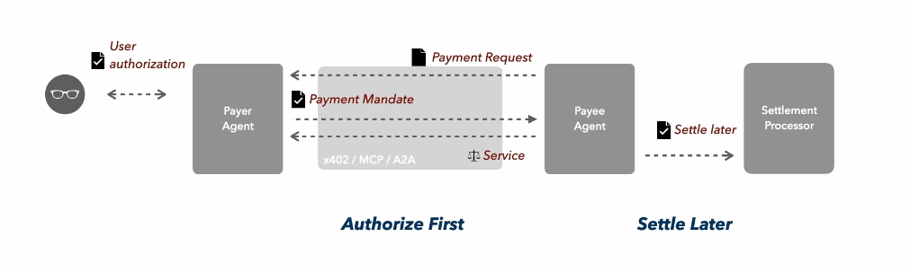

# AEP2 Protocol - Solana Implementation

Complete documentation for the Solana implementation of the Agent Embedded Payment (AEP2) protocol for AI-native payment solutions.

## Table of Contents

- [Overview](#overview)
- [Architecture](#architecture)
- [Key Features](#key-features)
- [Prerequisites](#prerequisites)
- [Installation](#installation)
- [Configuration](#configuration)
- [Program Architecture](#program-architecture)
- [API Documentation](#api-documentation)
- [Development](#development)
- [Testing](#testing)
- [Deployment](#deployment)
- [Security Considerations](#security-considerations)
- [Troubleshooting](#troubleshooting)
- [Resources](#resources)

## Overview

AEP2 is an embedded payment protocol designed for agent commerce. It enables AI agents to embed one-time payment mandates within API calls — enabling instant payee verification and deferred settlement after execution.

This Solana implementation provides the same functionality as the EVM version but leverages Solana's high-performance blockchain for faster settlements and lower transaction costs.



### Why Solana?

- ✅ **Fast transactions** (~400ms finality)
- ✅ **Low costs** (~$0.00025 per transaction)
- ✅ **High throughput** (thousands of TPS)
- ✅ **Modern blockchain** experience
- ✅ **Instant finality**

### Comparison: Solana vs EVM

| Feature | Solana Implementation | EVM Implementation |
|---------|----------------------|-------------------|
| Programming Language | Rust (Anchor) | Solidity |
| Signature Scheme | Ed25519 | ECDSA (EIP-712) |
| Transaction Speed | ~400ms | ~15 seconds |
| Transaction Cost | ~$0.00025 | ~$0.50-$2 |
| Token Standard | SPL Token | ERC-20 |
| Replay Protection | Nonce array | Nonce mapping |
| Account Model | Account-based | Account-based |

## Architecture

### Components

1. **Solana Program (DebitWallet)**: On-chain program managing user funds, delayed withdrawals, and settlement
2. **Settlement Processor (SP)**: Validates mandates, provides settlement commitments, and processes on-chain settlements
3. **Payee Service**: Demo merchant service that requires payment via AEP2 protocol
4. **Client**: Example implementation for creating mandates and calling paid APIs
5. **Frontend Playground**: Interactive UI for testing the full flow

### Flow

```
Client -> (X-Payment-Mandate header) -> Payee
Payee -> (POST /enqueue) -> SP
SP -> (validates & returns receipt) -> Payee
Payee -> (returns data + receipt) -> Client
SP (worker) -> (settle on-chain) -> Solana Program
```

### File Structure

```
APE2_MVP/
├── contracts/solana/          # Solana program (Rust/Anchor)
│   ├── programs/
│   │   └── aep2_debit_wallet/
│   │       └── src/lib.rs     # Main program code
│   └── Anchor.toml
├── services/                   # Backend services
│   ├── sp-solana.ts          # Settlement Processor
│   ├── payee-solana.ts       # Payee Service
│   ├── faucet-solana.ts      # Faucet Service
│   └── client-solana.ts      # Example client
├── scripts/solana/            # Deployment scripts
├── playground/                # Frontend playground
│   ├── app/solana/           # Solana frontend
│   └── components/           # React components
└── logs/solana/              # Service logs
```

## Key Features

- **Solana Native**: Built with Anchor framework for security and efficiency
- **SPL Token Support**: Works with any SPL token (USDC, USDT, etc.)
- **Delayed Withdrawals**: 3-hour withdrawal lock protects settlement window
- **Nonce-based Replay Protection**: Prevents duplicate settlements
- **Off-chain Balance Tracking**: SP maintains local state for fast validation
- **EIP-712-like Signing**: Structured data signing for Solana

## Prerequisites

### Required Software

- **Node.js** >= 18
- **Rust** and Cargo (for Solana program development)
- **Anchor CLI** >= 0.29.0
- **Solana CLI** >= 1.17
- **Phantom wallet** (for frontend)

### Installation

#### 1. Install Rust and Cargo

```bash
curl --proto '=https' --tlsv1.2 -sSf https://sh.rustup.rs | sh
source $HOME/.cargo/env
rustup component add rustfmt
```

Verify:
```bash
rustc --version
cargo --version
```

#### 2. Install Solana CLI

```bash
sh -c "$(curl -sSfL https://release.solana.com/v1.17.0/install)"
```

Add to PATH (add to ~/.bashrc or ~/.zshrc):
```bash
export PATH="$HOME/.local/share/solana/install/active_release/bin:$PATH"
```

Verify:
```bash
solana --version
```

#### 3. Install Anchor

```bash
cargo install --git https://github.com/coral-xyz/anchor avm --locked --force
avm install latest
avm use latest
```

Verify:
```bash
anchor --version
```

#### 4. Install Node.js Dependencies

```bash
npm install
cd playground
npm install
cd ..
```

## Configuration

### Solana CLI Configuration

```bash
solana config set --url devnet
solana config set --commitment confirmed
```

Verify:
```bash
solana config get
```

### Create Wallets

#### Authority/Deployer Wallet
```bash
solana-keygen new -o ~/.config/solana/id.json
solana-keygen pubkey ~/.config/solana/id.json
solana airdrop 2  # Fund wallet
```

#### SP Wallet
```bash
solana-keygen new -o ~/.config/solana/sp-keypair.json
SP_ADDRESS=$(solana-keygen pubkey ~/.config/solana/sp-keypair.json)
echo "SP Address: $SP_ADDRESS"
solana airdrop 2 $SP_ADDRESS
```

#### Payee Wallet
```bash
solana-keygen new -o ~/.config/solana/payee-keypair.json
PAYEE_ADDRESS=$(solana-keygen pubkey ~/.config/solana/payee-keypair.json)
echo "Payee Address: $PAYEE_ADDRESS"
```

#### Client Wallet
```bash
solana-keygen new -o ~/.config/solana/client-keypair.json
CLIENT_ADDRESS=$(solana-keygen pubkey ~/.config/solana/client-keypair.json)
echo "Client Address: $CLIENT_ADDRESS"
solana airdrop 1 $CLIENT_ADDRESS
```

#### Faucet Wallet
```bash
solana-keygen new -o ~/.config/solana/faucet-keypair.json
FAUCET_ADDRESS=$(solana-keygen pubkey ~/.config/solana/faucet-keypair.json)
echo "Faucet Address: $FAUCET_ADDRESS"
solana airdrop 5 $FAUCET_ADDRESS
```

### Get Private Keys in Base58

You'll need Base58 encoded private keys for services. Use the helper script:

```bash
node get-base58-key.js ~/.config/solana/sp-keypair.json
node get-base58-key.js ~/.config/solana/client-keypair.json
node get-base58-key.js ~/.config/solana/faucet-keypair.json
```

Save these keys securely!

## Program Development and Deployment

### 1. Build the Program

```bash
cd contracts/solana
anchor build
```

This compiles the Rust program to BPF bytecode.

### 2. Get Program ID

```bash
solana address -k target/deploy/aep2_debit_wallet-keypair.json
```

### 3. Update Program ID in Code

Edit `contracts/solana/programs/aep2_debit_wallet/src/lib.rs`:
```rust
declare_id!("YOUR_PROGRAM_ID_HERE");
```

Edit `contracts/solana/Anchor.toml`:
```toml
[programs.devnet]
aep2_debit_wallet = "YOUR_PROGRAM_ID_HERE"
```

### 4. Rebuild with Correct ID

```bash
anchor build
```

### 5. Deploy

```bash
anchor deploy
```

This will:
- Upload the program to Solana devnet
- Make it executable
- Set you as the upgrade authority

### 6. Verify Deployment

```bash
solana program show <PROGRAM_ID>
```

Should show:
- Program ID
- Owner: BPFLoaderUpgradeable
- Your address as upgrade authority

### 7. Create Test USDC Mint

For devnet testing, create a test USDC token:

```bash
npm run solana:create-usdc
```

## Environment Configuration

### Root `.env` File

Create `.env` in the root directory:

```env
# Solana Network
SOLANA_RPC_URL=https://api.devnet.solana.com
SOLANA_NETWORK=devnet

# Program
PROGRAM_ID=<YOUR_DEPLOYED_PROGRAM_ID>
SOLANA_USDC_MINT=<YOUR_TEST_USDC_MINT>

# Settlement Processor
SP_SOLANA_PK=<SP_PRIVATE_KEY_BASE58>
SP_PORT=3001

# Payee Service
PAYEE_SOLANA_ADDRESS=<PAYEE_PUBLIC_KEY>
PAYEE_PORT=3002
SP_URL=http://localhost:3001

# Client
CLIENT_SOLANA_PK=<CLIENT_PRIVATE_KEY_BASE58>
PAYEE_URL=http://localhost:3002

# Faucet
FAUCET_SOLANA_PK=<FAUCET_PRIVATE_KEY_BASE58>
FAUCET_PORT=3003
```

### Frontend `.env.local` File

Create `playground/.env.local`:

```env
NEXT_PUBLIC_PROGRAM_ID=<YOUR_DEPLOYED_PROGRAM_ID>
NEXT_PUBLIC_SOLANA_USDC_MINT=<YOUR_TEST_USDC_MINT>
NEXT_PUBLIC_FAUCET_URL=http://localhost:3003
NEXT_PUBLIC_SP_URL=http://localhost:3001
NEXT_PUBLIC_PAYEE_URL=http://localhost:3002
NEXT_PUBLIC_SOLANA_RPC_URL=https://api.devnet.solana.com
```

See `playground/.env.local.example` for a complete example.

## Program Initialization

### 1. Initialize Program State

```bash
npm run solana:init
```

This initializes the wallet state with a 3-hour withdrawal delay.

### 2. Authorize SP

```bash
npm run solana:authorize-sp
```

This authorizes the Settlement Processor to settle payments on-chain.

### 3. Create Test USDC (Devnet Only)

```bash
npm run solana:create-usdc
```

This creates a test USDC mint for devnet testing.

## Starting Services

### Option 1: Start All Services Together

```bash
npm run start:solana
```

This starts:
- Settlement Processor (port 3001)
- Payee Service (port 3002)
- Faucet Service (port 3003)
- Frontend Playground (port 3000)

### Option 2: Start Services Individually

**Terminal 1 - Settlement Processor:**
```bash
npm run sp:solana
```

**Terminal 2 - Payee Service:**
```bash
npm run payee:solana
```

**Terminal 3 - Faucet:**
```bash
npm run faucet:solana
```

**Terminal 4 - Frontend:**
```bash
cd playground
npm run dev
```

## Testing the Complete Flow

### 1. Open Frontend

Navigate to http://localhost:3000/solana

### 2. Connect Phantom Wallet

- Install Phantom browser extension
- Create or import wallet
- Switch to Devnet in settings (Settings → Change Network → Devnet)
- Click "Connect Phantom Wallet"

### 3. Get Test Tokens

- Click "Claim Test SOL & USDC"
- Approve transaction in Phantom
- Wait for confirmation
- Balances should update

### 4. Deposit to Debit Wallet

- Click "Deposit to Debit Balance"
- Enter amount (e.g., 1 USDC)
- Approve transaction
- Wait for confirmation

### 5. Create and Sign Mandate

- Enter payee address (default: `XCnvjv6dVRcMucjDZvJ1JzhM3D1czR6QM7WAh6SrA4F`)
- Enter amount (e.g., 0.001 USDC)
- Click "Sign Mandate"
- Approve signature in Phantom
- Copy Base64 encoded mandate

### 6. Test API Call

Go to the Payee Panel:
- Paste the mandate Base64 in the `X-Payment-Mandate` header
- Click "Send HTTP Request"
- Should receive 200 with ETH-USD price
- Payment receipt included in response

### 7. Monitor Settlement

Go to SP Panel:
- View queued mandates
- Watch settlement status
- Check transaction on Solana Explorer

### 8. Test Command Line Client

```bash
# Test with payment
npm run client:solana

# Test without payment (should get 402)
npm run client:solana no-payment
```

## Program Architecture

### Accounts

#### WalletState
- `authority`: Program authority
- `withdraw_delay`: Withdrawal lock period (seconds, default: 3 hours)
- `bump`: PDA bump seed

#### UserAccount
- `balance`: Available balance for debit
- `withdraw_lock`: Withdrawal lock information
  - `locked`: Amount locked for withdrawal
  - `unlock_at`: Timestamp when withdrawal can execute
- `used_nonces`: List of used nonces (replay protection, limited to 100)

#### SPAccount
- `sp`: Settlement processor public key
- `enabled`: Authorization status
- `bump`: PDA bump seed

### Instructions

1. **initialize**: Initialize the program state
   - Sets authority and withdrawal delay
   - Creates WalletState PDA

2. **deposit**: Deposit SPL tokens into debit wallet
   - Transfers tokens from user to program PDA
   - Updates user balance

3. **request_withdraw**: Request withdrawal (enters lock period)
   - Locks amount for withdrawal
   - Sets unlock timestamp (current time + delay)

4. **execute_withdraw**: Execute withdrawal after delay
   - Transfers tokens from program PDA to user
   - Clears withdrawal lock

5. **settle**: Settle a payment using signed mandate (SP only)
   - Validates mandate signature
   - Checks nonce not used
   - Verifies sufficient balance
   - Transfers tokens to payee
   - Marks nonce as used

6. **set_sp**: Authorize or revoke SP
   - Only callable by program authority
   - Creates or updates SPAccount

## API Documentation

### Settlement Processor

#### POST /enqueue

Validates mandate and commits to settlement.

**Request:**
```json
{
  "mandate": {
    "payer": "Client's Solana address",
    "token": "SPL token mint address",
    "payee": "Payee's Solana address",
    "amount": "1000",
    "nonce": "123456",
    "deadline": 1234567890,
    "ref": "order-123"
  },
  "payerSig": "Base58 signature"
}
```

**Response:**
```json
{
  "success": true,
  "receipt": {
    "sp": "SP Solana address",
    "mandateDigest": "Base58 digest",
    "enqueueDeadline": 1234567890,
    "spEnqueueSig": "Base58 signature"
  }
}
```

**Error Responses:**
- `400`: Invalid mandate, expired deadline, duplicate mandate, nonce used
- `402`: Insufficient balance
- `500`: Internal error

#### GET /health

Health check with statistics.

**Response:**
```json
{
  "status": "ok",
  "sp": "SP Solana address",
  "programId": "Program ID",
  "network": "solana-devnet",
  "queueLength": 5,
  "settled": 100,
  "failed": 2,
  "history": [...]
}
```

### Payee Service

#### GET /predict

Protected endpoint requiring payment.

**Headers:**
- `X-Payment-Mandate`: Base64-encoded mandate + signature

**Response (Success):**
```json
{
  "symbol": "ETH-USD",
  "price": 3500.42,
  "timestamp": 1234567890,
  "payment": {
    "status": "enqueued",
    "spReceipt": {
      "sp": "...",
      "mandateDigest": "...",
      "enqueueDeadline": 1234567890,
      "spEnqueueSig": "..."
    }
  }
}
```

**Response (402 - Payment Required):**
```json
{
  "error": "PAYMENT_REQUIRED",
  "message": "Missing X-Payment-Mandate header",
  "price": 0.001,
  "currency": "USDC",
  "network": "solana-devnet",
  "payee": "...",
  "token": "..."
}
```

#### GET /health

Health check endpoint.

### Faucet Service

#### POST /claim

Claim test SOL and USDC.

**Request:**
```json
{
  "address": "Solana address"
}
```

**Response:**
```json
{
  "success": true,
  "transactions": {
    "sol": {
      "signature": "...",
      "amount": "0.1 SOL"
    },
    "usdc": {
      "signature": "...",
      "amount": "3 USDC"
    }
  }
}
```

**Error Responses:**
- `400`: Invalid address
- `429`: Rate limited (1 hour between claims)

## Development

### Run Services Individually

```bash
# Settlement Processor
npm run sp:solana

# Payee Service
npm run payee:solana

# Faucet
npm run faucet:solana

# Frontend
cd playground
npm run dev
```

### Run Client Demo

```bash
# With payment
npm run client:solana

# Without payment (test 402 response)
npm run client:solana no-payment
```

### Frontend Development

```bash
cd playground
npm run dev
# Visit http://localhost:3000/solana
```

### Smart Contract Development

```bash
cd contracts/solana
anchor build
anchor test
anchor deploy
```

## Testing

### Unit Tests

```bash
cd contracts/solana
anchor test
```

### Integration Tests

```bash
# Start all services
npm run start:solana

# Run integration tests
npm test:solana
```

### Manual Testing

```bash
# Test with payment
npm run client:solana

# Test without payment (should get 402)
npm run client:solana no-payment
```

## Deployment

### Deployment Checklist

- [ ] Build and deploy Solana program
- [ ] Initialize program state
- [ ] Create and fund SP wallet
- [ ] Authorize SP on-chain
- [ ] Create and fund faucet wallet (devnet only)
- [ ] Configure all environment variables
- [ ] Test full flow end-to-end
- [ ] Set up monitoring and logging
- [ ] Configure proper withdrawal delay
- [ ] Document emergency procedures

### Production Considerations

1. **Mainnet Deployment**
   - Use mainnet RPC endpoints
   - Fund accounts with real SOL
   - Use real USDC mint
   - Thoroughly test on devnet first

2. **Security**
   - Store private keys in secure key management system
   - Set up proper monitoring and alerts
   - Implement rate limiting
   - Regular security audits

3. **Performance**
   - Use dedicated RPC nodes
   - Implement caching
   - Optimize database queries
   - Monitor transaction success rates

4. **Backup**
   - Backup program keypairs
   - Backup database regularly
   - Document recovery procedures
   - Test backup restoration

## Security Considerations

1. **Private Keys**: Never commit private keys or keypair files
2. **Program Authority**: Carefully manage program upgrade authority
3. **SP Authorization**: Only authorize trusted SPs
4. **Nonce Management**: Nonces stored in account (limited to 100)
5. **Withdrawal Delay**: Default 3 hours protects settlement window
6. **Balance Validation**: SP validates balance before enqueue
7. **Signature Verification**: All mandates must be signed by payer
8. **Deadline Enforcement**: Mandates expire after deadline

## Troubleshooting

### Program Not Deployed

```bash
# Check deployment
solana program show <PROGRAM_ID>

# Redeploy if needed
cd contracts/solana
anchor deploy
```

### Build Errors

```bash
# Clean and rebuild
cd contracts/solana
anchor clean
anchor build
```

### Deployment Failures

```bash
# Check balance
solana balance

# If insufficient, airdrop more
solana airdrop 2

# Check program size
ls -lh target/deploy/*.so

# If too large, optimize
cargo build-bpf --release
```

### Insufficient SOL for Transactions

```bash
# Airdrop SOL (devnet only)
solana airdrop 2 <ADDRESS> --url devnet
```

### Phantom Wallet Not Connecting

- Ensure Phantom is installed
- Check that you're on Solana Devnet in Phantom settings
- Try disconnecting and reconnecting
- Refresh page after changing network

### SP Not Settling Transactions

- Check SP logs: `tail -f logs/solana/sp.log`
- Verify SP is authorized on-chain
- Ensure SP has sufficient SOL for transaction fees
- Check mandate deadlines haven't expired
- Verify payee token accounts exist

### Transaction Failures

- Check account has sufficient SOL
- Verify all PDAs are correctly derived
- Check program logs:
  ```bash
  solana logs <PROGRAM_ID>
  ```
- Verify token accounts exist
- Check nonce hasn't been used

### Services Won't Start

```bash
# Check ports
lsof -i :3000
lsof -i :3001
lsof -i :3002
lsof -i :3003

# Kill if needed
pkill -f "node"
```

### Verification

**Check Program State:**
```bash
solana account <PROGRAM_ID>
```

**Check User Balance:**
Use Solana Explorer: https://explorer.solana.com/?cluster=devnet

Search for your address and check:
- SOL balance
- Token accounts
- Transaction history

**Check SP Database:**
```bash
sqlite3 ~/.sp_data_solana/.sp-solana-data.db "SELECT * FROM mandates"
```

## Resources

- [Solana Documentation](https://docs.solana.com/)
- [Anchor Framework](https://www.anchor-lang.com/)
- [SPL Token Program](https://spl.solana.com/token)
- [Phantom Wallet](https://phantom.app/)
- [Solana Explorer (Devnet)](https://explorer.solana.com/?cluster=devnet)

## License

MIT

## Contributing

Contributions welcome! Please read our contributing guidelines and submit pull requests to our repository.

## Support

For issues or questions:
1. Check the troubleshooting section
2. Review Solana and Anchor documentation
3. Open an issue on GitHub

---

**For a quick start, see [SOLANA_QUICKSTART.md](SOLANA_QUICKSTART.md)**
